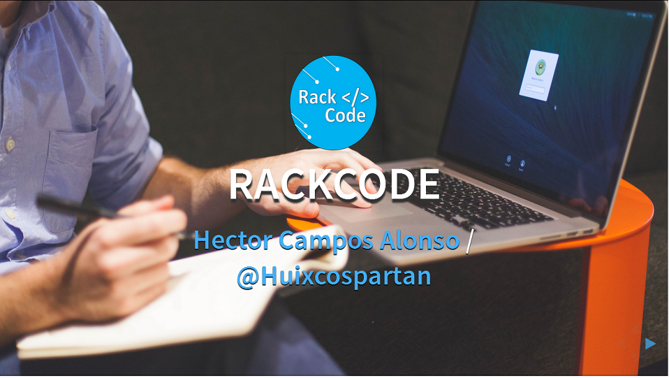

# Taller-de-Java-e-Hibernate - Rackcode by @Huixcospartan

*Plataforma de Educacion Online [Rackcode](//rackcode.info)*

En este taller estudiaremos una introducción al Framework de Hibernate, incluyendo el concepto ORM (Object-Relational Mapping), el cual resuelve muchos de los problemas que se presenta en la capa de datos en una aplicación de Java Empresarial. 

Estudiaremos una introducción al Framework de Hibernate, y la esencia de trabajar con este Framework Java. Instalaremos nuestro IDE, en este caso MyEclipse, para trabajar con el Framework de Hibernate Instalaremos nuestra base de datos MySql, con la que trabajaremos a lo largo del curso Configuraremos un primer ejemplo con Conexión a Bases de Datos con MyEclipse y Hibernate Crearemos un primer ejercicio para explicar cómo trabajaremos con los objetos de Java y su representación en una tabla de base de datos aplicando el concepto de ORM  Operaciones con Hibernate: Pondremos en práctica las operaciones básicas (alta, bajas y cambios) que comúnmente utilizamos en nuestras tablas de base de datos aplicando los patrones de diseño MVC.

## Licencia

Copyright (c) 2015 Hector Campos Alonso

